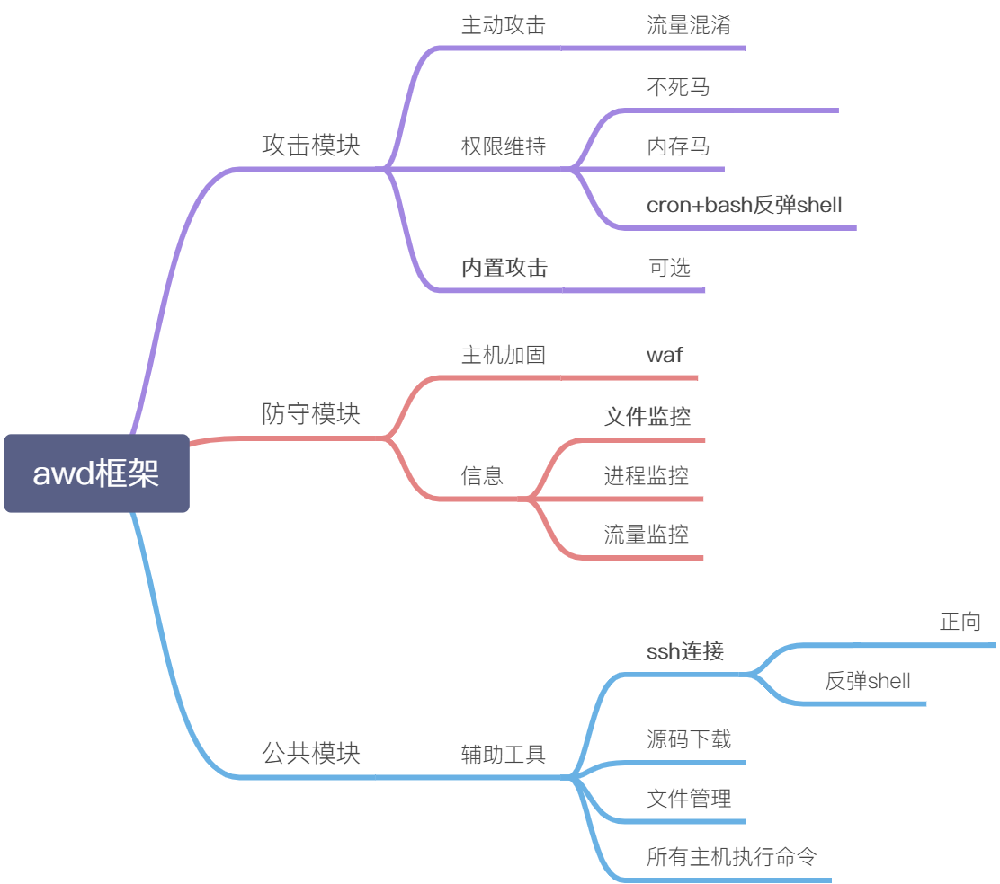

<h1 align="center">WolfAWD 🛠</h1>

  
  

# 项目介绍

目前 github 上还没有一个将 AWD 框架做到可视化的项目，随着近些年 CTF 比赛越发的盛行，越来越多的 awd 脚本需求出现了，这个项目就是想要做出目前第一个也就是独一份的 AWD 比赛可视化辅助脚本，可以让参赛选手在比赛中腾出更多的时间来进行代码审计，也可以为新人节省更多的精力

## 基本想法

利用 mvc 框架，显示和功能分离，
每次比赛的数据都放在到 games 里

## 目录结构

├── data # 框架运行所需要的持久化文件  
├── games  
├── library  
│ ├── controller  
│ │ ├── common  
│ │ ├── defense  
│ │ └── exploit  
│ ├── models  
│ └── views  
│ │ ├── common  
│ │ ├── defense  
│ │ └── exploit  
│ ├── common  
│ ├── defense  
│ └── exploit  
├── config.py  
├── README.md  
└── requirements.txt

## 数据表结构 （语雀完善中）

### poc

| 字段名称 |     类型     |                 说明                 |
| :------: | :----------: | :----------------------------------: |
|    id    |     int      |            索引（自增 id             |
|   name   | varchar（30) |                 名称                 |
|   type   |    int(2)    | 类型 0 flag 1 webshell 2 systemshell |
|    os    |     int      |        系统类别 0 php1 python        |

### target

|     字段名称     |     类型     | 说明            |
| :--------------: | :----------: | --------------- |
|        id        |     int      | 索引（自增 id） |
|        ip        | varchar（30) | 名称            |
|     is_reach     |              | 类型            |
|   is_get_shell   |              | 系统类别        |
|       flag       |              |                 |
| flag_create_time |              |                 |

### 流量

| 字段名称   | 类型         | 说明            |
| ---------- | ------------ | --------------- |
| id         | int          | 索引（自增 id） |
| message    | varchar（30) | 名称            |
| type       |              | 类型 (get post) |
| host       |              | 系统类别        |
| source_ip  |              |                 |
| create_ime |              |                 |

## 需求

https://github.com/orgs/wgpsec/projects/3

暂时想到这么多，师傅们有想法请加进去

# 更新日志

- 2020-08-31

  - 完成第一版初版

- 2020-9-1

  - 加入 SSH 连接功能

- 2020-9-2
  
  - 加入命令发送全部主机功能
  
- 2020-9-3

  - 完善配置读取

- 2020-9-16

- 2020-10-11

  - 开始恶补php开始写waf，计划waf作为防御模块的核心
  - AdianGg:最近比较忙，今天起继续不断更新，今日增加了配置读写 Class，并修改了文件上传下载，SSH 连接的一些代码，还要加入的有文件管理的列远程目录，配置 wwwroot，实现内部的指令进行下载，在配置读写的 Class 中加入输出全部主机配置的功能

  ## 参考资料

  AWD webshell
  https://github.com/3sNwgeek/awd_worm_phpwebshell_framework/
